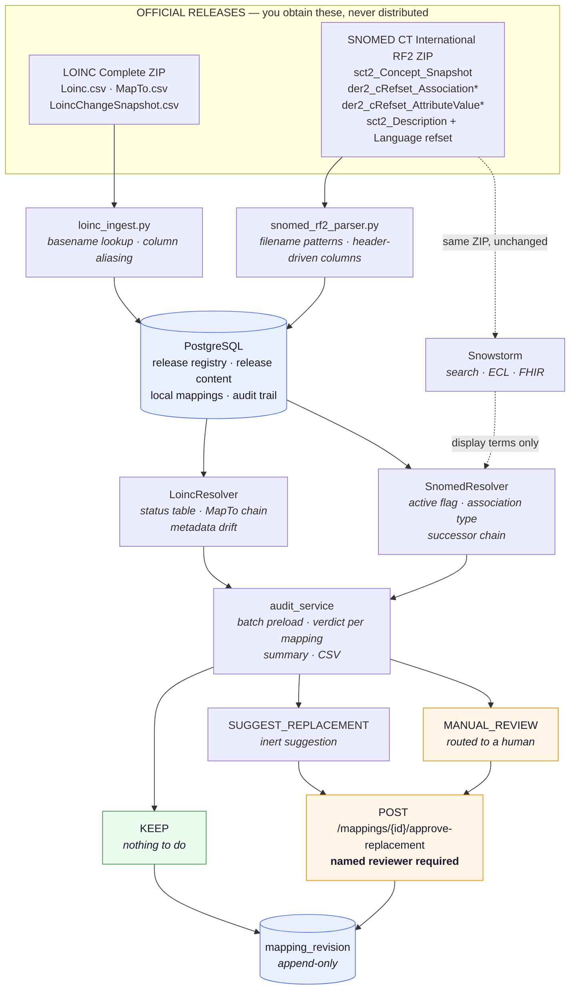
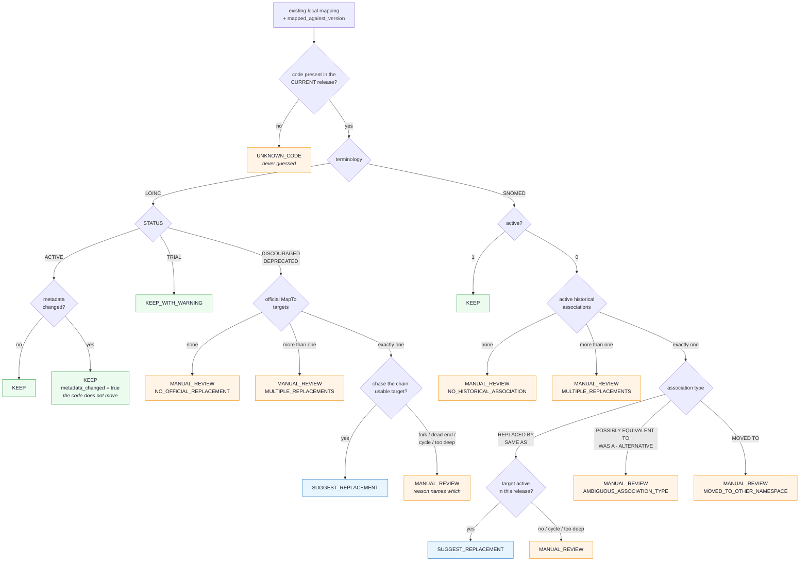

# Architecture

## System diagram



<details>
<summary>Same diagram as plain text (for terminals and print)</summary>

```
                         +-------------------------------------------+
                         |            OFFICIAL RELEASES              |
                         |   (you obtain these; never distributed)   |
                         +---------------------+---------------------+
                                               |
              +--------------------------------+--------------------------------+
              |                                                                 |
   LOINC Complete ZIP                                            SNOMED CT International RF2 ZIP
   Loinc.csv                                                     sct2_Concept_Snapshot*.txt
   MapTo.csv                                                     der2_cRefset_Association*Snapshot*.txt
   LoincChangeSnapshot.csv                                       der2_cRefset_AttributeValue*Snapshot*.txt
              |                                                                 |
              v                                                                 v
   +----------------------+                                   +--------------------------------+
   |   loinc_ingest.py    |                                   |     snomed_rf2_parser.py       |
   |  basename lookup     |                                   |  filename-pattern lookup       |
   |  column aliasing     |                                   |  header-driven columns         |
   +----------+-----------+                                   +----------------+---------------+
              |                                                                |
              |                                       (the same ZIP, unchanged)|
              |                                                                +---------> Snowstorm
              |                                                                |            (search,
              v                                                                v            preferred
   +-------------------------------------------------------------------------------+       terms, FHIR)
   |                              PostgreSQL                                       |
   |  terminology_release | loinc_concept_version | loinc_map_to | loinc_change     |
   |  snomed_concept_version | snomed_historical_association | snomed_inactivation  |
   |  local_mapping | mapping_revision | audit_run | audit_result                   |
   +----------------------------------+--------------------------------------------+
                                      |
                +---------------------+----------------------+
                |                                            |
      +---------v---------+                        +---------v---------+
      |  LoincResolver    |                        |  SnomedResolver   |
      |  status table     |                        |  active flag      |
      |  MapTo chain      |                        |  association type |
      |  metadata drift   |                        |  successor chain  |
      +---------+---------+                        +---------+---------+
                |                                            |
                +---------------------+----------------------+
                                      |
                          +-----------v-----------+
                          |     audit_service     |
                          |  batch preload        |
                          |  per-mapping verdict  |
                          |  summary + CSV        |
                          +-----------+-----------+
                                      |
        +-----------------------------+-----------------------------+
        |                             |                             |
      KEEP                 SUGGEST_REPLACEMENT               MANUAL_REVIEW
   (nothing to do)          (inert suggestion)          (routed to a human)
        |                             |                             |
        +-----------------------------+-----------------------------+
                                      |
                        POST /mappings/{id}/approve-replacement
                                      |
                          +-----------v-----------+
                          |   mapping_revision    |
                          |     append-only       |
                          +-----------------------+
```

</details>

## The decision path, end to end



Every orange box is an **abstention**: the engine declines and hands the case to a person. The
audit reports how often that happened as its abstention rate.

## Why the RF2 files are parsed locally as well as pushed to Snowstorm

Snowstorm is excellent at what it is for: term search, ECL, preferred terms, a browser, and the
standard FHIR terminology endpoints. It is not the right dependency for version-aware reasoning:

- its branch state is mutable, so a verdict computed from it is not reproducible from files alone;
- it holds *one* imported state per branch, so it cannot answer "what changed between release A
  and release B" offline;
- it is a large stack (Elasticsearch, ~8 GB RAM) whose absence would otherwise block every audit.

So the auditor reads the locally parsed tables, and Snowstorm only enriches display terms and
serves search. `SnowstormClient.health()` never raises; the API surfaces its state at `/health`,
and `/api/v1/snomed/search` — the one endpoint that genuinely needs it — returns a clear 503 when
it is down.

## Data flow of a single audit

1. `run_audit` reads the current release rows for LOINC and SNOMED from `terminology_release`.
2. It creates an `audit_run` stamped with both versions, plus the scope filter.
3. It selects the mappings in scope and **batch-preloads** everything the resolvers will need:
   concepts, MapTo rows, associations, inactivations, and the older-release baselines used for
   metadata-drift detection.
4. Each mapping is resolved from cached data. Chain following (MapTo / historical association)
   may fetch a small number of extra rows, cached per resolver instance.
5. Each verdict is written as an `audit_result`, including the suggested targets as JSON, the
   reason code, and the metadata used to reach the decision.
6. Mappings that need attention are flagged `NEEDS_REVIEW`. **No target code is touched.**
7. A summary and a CSV report are written.

The batch preload is what keeps a 10,000-mapping audit at single-digit SQL statements; the
performance test asserts this rather than trusting it.

## Chain following

Both resolvers follow a successor chain with the same three guards:

- **visited set** — a cycle returns `REPLACEMENT_CHAIN_CYCLE`, never an infinite loop;
- **depth limit** — configurable via `MAX_REPLACEMENT_CHAIN_DEPTH`, returns
  `REPLACEMENT_CHAIN_TOO_DEEP`;
- **fork detection** — a hop with more than one successor stops with `MULTIPLE_REPLACEMENTS`.

A chain is only followed along semantically strong links: LOINC `MapTo`, and SNOMED
`REPLACED BY` / `SAME AS`. The engine never walks a `POSSIBLY EQUIVALENT TO` or a `WAS A` edge in
search of something to suggest.

## Deployment shapes

| Shape | What runs | What works | What does not |
|---|---|---|---|
| **Zero-config** | Python only, SQLite | every audit, both diffs, all reports, the full API | SNOMED term search |
| **Standard** | + PostgreSQL (`docker compose up -d`) | the above, at production scale | SNOMED term search |
| **Full** | + Snowstorm/Elasticsearch (~8 GB RAM) | everything, including search and FHIR `$lookup` | — |

The zero-config shape is deliberate: a supervisor should be able to clone the repository and see
the whole pipeline run on synthetic releases without installing anything but Python.

## Extension points for later thesis stages

The layers a microbiology mapper will add sit *above* this core and consume its API:

- **candidate retrieval** — `GET /api/v1/snomed/search` already returns active-only candidates;
- **a proposed mapping** — `POST /api/v1/mappings` with `map_correlation` and a
  `mapped_against_version`, so a model's output is version-stamped from birth;
- **uncertainty** — a model that abstains maps naturally onto the existing
  `MANUAL_REVIEW` decision and the abstention-rate metric;
- **staying fresh** — the audit engine already tells the model's output when it has gone stale.

Nothing in the later stages requires changing the decision tables here.
