# Database schema

Twelve tables in three groups: the **release registry**, the **release content**, and the
**local mappings with their audit trail**.

## Entity relationships

```mermaid
erDiagram
    terminology_release ||--o{ loinc_concept_version : "scopes"
    terminology_release ||--o{ loinc_map_to : "scopes"
    terminology_release ||--o{ loinc_change : "scopes"
    terminology_release ||--o{ snomed_concept_version : "scopes"
    terminology_release ||--o{ snomed_historical_association : "scopes"
    terminology_release ||--o{ snomed_inactivation : "scopes"
    terminology_release ||--o{ snomed_concept_term : "scopes"

    local_mapping ||--o{ mapping_revision : "append-only history"
    local_mapping ||--o{ audit_result : "judged by"
    audit_run ||--o{ audit_result : "contains"
    audit_result |o--o{ mapping_revision : "justifies"

    terminology_release {
        int id PK
        string system "LOINC | SNOMED_CT"
        string version "from import metadata, never hard-coded"
        date effective_date
        string sha256 "content identity"
        string source_filename
        datetime imported_at
        bool is_current "exactly one true per system"
        string import_status
    }

    loinc_concept_version {
        string loinc_num "UQ with release_version"
        string release_version
        string status "ACTIVE|TRIAL|DISCOURAGED|DEPRECATED"
        string long_common_name
        string component
        string property
        string time_aspect
        string system
        string scale_type
        string method_type
        string class_name
    }

    loinc_map_to {
        string source_loinc
        string target_loinc "never collapsed: several are valid"
        string comment
        string release_version
    }

    loinc_change {
        string loinc_num
        string property
        string value_prior
        string value_current
        string change_reason
        string release_version
    }

    snomed_concept_version {
        string concept_id "UQ with release_version"
        string release_version
        bool active
        string effective_time
        string module_id
        string definition_status_id
    }

    snomed_historical_association {
        string member_id
        string refset_id "REPLACED BY | SAME AS | ..."
        string referenced_component_id
        string target_component_id
        bool active "inactive members ignored when suggesting"
        string release_version
    }

    snomed_inactivation {
        string member_id
        string concept_id
        string value_id "why it became inactive"
        bool active
        string release_version
    }

    snomed_concept_term {
        string concept_id "UQ with release_version"
        string release_version
        string fsn "fully specified name"
        string preferred_term "from the language reference set"
        string language_refset_id "which dialect supplied it"
    }

    local_mapping {
        int id PK
        string source_dataset
        string local_code
        string local_text
        json local_context_json
        string target_system
        string target_code
        string mapped_against_version "the whole point"
        string map_correlation
        string review_status
    }

    mapping_revision {
        int id PK
        int mapping_id FK
        string old_target_code
        string old_target_version
        string new_target_code
        string new_target_version
        string reason
        bool approved
        string approved_by "attributable"
        datetime approved_at
    }

    audit_run {
        int id PK
        datetime started_at
        string loinc_version "stamped for reproducibility"
        string snomed_version
        int mapping_count
        string status
        json summary_json
        string report_path
    }

    audit_result {
        int id PK
        int audit_run_id FK
        int mapping_id FK
        string target_system
        string old_code
        string current_version "judged against, not mapped against"
        string terminology_status
        string decision
        json suggested_targets_json
        string reason
        json metadata_json
    }
```



<details>
<summary>Same schema as a plain-text drawing (for terminals and print)</summary>

```
                        +----------------------------+
                        |    terminology_release     |
                        |----------------------------|
                        | id                    PK   |
                        | system   LOINC|SNOMED_CT   |
                        | version                    |   <- from import metadata, never hard-coded
                        | effective_date             |
                        | sha256                     |   <- content identity
                        | source_filename            |
                        | imported_at                |
                        | is_current                 |   <- exactly one true per system
                        | import_status              |
                        | notes                      |
                        | UQ(system, sha256)         |
                        | UQ(system, version)        |
                        +-------------+--------------+
                                      |
        +----------------+------------+------------+----------------+----------------+
        |                |                         |                |                |
        v                v                         v                v                v
+---------------+ +--------------+  +------------------------+ +------------------+ +-------------------+
|loinc_concept_ | |loinc_map_to  |  | snomed_concept_version | | snomed_historical| |snomed_inactivation|
|   version     | |--------------|  |------------------------| |   _association   | |-------------------|
|---------------| | release_id FK|  | release_id         FK  | |------------------| | release_id     FK |
| release_id FK | | release_ver  |  | release_version        | | release_id    FK | | release_version   |
| release_ver   | | source_loinc |  | concept_id             | | release_version  | | member_id         |
| loinc_num     | | target_loinc |  | effective_time         | | member_id        | | concept_id        |
| status        | | comment      |  | active                 | | refset_id        | | value_id          |
| long_common_. | |              |  | module_id              | | referenced_comp. | | effective_time    |
| short_name    | | UQ(src,tgt,  |  | definition_status_id   | | target_comp_id   | | active            |
| component     | |    release)  |  |                        | | effective_time   | |                   |
| property      | +--------------+  | UQ(concept_id,         | | active           | | UQ(member_id,     |
| time_aspect   |                   |    release_version)    | |                  | |    release_ver)   |
| system        | +--------------+  +------------------------+ | UQ(member_id,    | +-------------------+
| scale_type    | | loinc_change |                             |    release_ver)  |
| method_type   | |--------------|                             +------------------+
| class_name    | | release_id FK|
| change_type   | | release_ver  |          +---------------------------+
| version_first.| | loinc_num    |          |    snomed_concept_term    |
| version_last. | | property     |          |---------------------------|
|               | | value_prior  |          | release_id            FK  |
| UQ(loinc_num, | | value_current|          | release_version           |
|    release_v) | | change_reason|          | concept_id                |
+---------------+ +--------------+          | fsn                       |
                                            | preferred_term            |
                                            | language_refset_id        |
                                            |                           |
                                            | UQ(concept_id,            |
                                            |    release_version)       |
                                            +---------------------------+
     one row per concept -- the ~1.4M description rows and ~2.8M language
     reference set rows they are resolved from are read once and discarded


        +---------------------------+                +--------------------------+
        |      local_mapping        |                |        audit_run         |
        |---------------------------|                |--------------------------|
        | id                   PK   |                | id                  PK   |
        | source_dataset            |                | started_at               |
        | source_system             |                | completed_at             |
        | local_code                |                | loinc_version            |
        | local_text                |                | snomed_version           |
        | local_context_json        |                | mapping_count            |
        | target_system             |                | status                   |
        | target_code               |                | summary_json             |
        | target_display            |                | scope_json               |
        | mapped_against_version    |  <- the point  | report_path              |
        | map_correlation           |                | error_message            |
        | review_status             |                +------------+-------------+
        | created_at / updated_at   |                             |
        | UQ(source_dataset,        |                             | 1..n
        |    local_code,            |                             v
        |    target_system)         |                +--------------------------+
        +------------+--------------+                |       audit_result       |
                     |                               |--------------------------|
                     | 1..n                          | id                  PK   |
                     v                               | audit_run_id        FK   |
        +---------------------------+  <-----------  | mapping_id          FK   |
        |     mapping_revision      |    audit_      | target_system            |
        |---------------------------|    result_id  | old_code                 |
        | id                   PK   |                | current_version          |
        | mapping_id           FK   |                | terminology_status       |
        | old_target_code           |                | decision                 |
        | old_target_version        |                | suggested_targets_json   |
        | new_target_code           |                | reason                   |
        | new_target_version        |                | metadata_json            |
        | reason                    |                | created_at               |
        | audit_result_id      FK   |                +--------------------------+
        | approved                  |
        | approved_by               |     APPEND-ONLY: rows are never updated
        | approved_at               |     and never deleted.
        | created_at                |
        +---------------------------+
```

</details>

## The three columns that carry the whole idea

| Column | Table | Why it matters |
|---|---|---|
| `mapped_against_version` | `local_mapping` | The release the mapping was made against. Without it, "is this mapping stale?" is unanswerable and metadata drift cannot be computed. |
| `current_version` | `audit_result` | The release the verdict was computed against — *not* the same thing. A published audit number is traceable to exact files. |
| `sha256` | `terminology_release` | Content identity. Renaming an archive does not create a second release; re-importing the same content is a no-op. |

## Invariants

1. **Exactly one current release per system.** `release_service.set_current` clears the previous
   flag inside the same transaction. Superseded releases keep every row they imported.
2. **One row per concept, not per description.** `snomed_concept_term` holds the resolved fully
   specified name and preferred term. The ~1.4 million description rows and ~2.8 million language
   reference set rows they come from are read once at import and discarded — the auditor never
   needs them again.
3. **Content is release-scoped.** Every content row carries both `release_id` and
   `release_version`; the composite uniqueness is on `(natural key, release_version)`, so two
   releases coexist and can be diffed.
4. **History is append-only.** `mapping_revision` rows are inserted, never updated. `A -> B -> C`
   yields two rows.
5. **Only one code path mutates `local_mapping.target_code`:** `mapping_service.approve_replacement`.
6. **Nothing is deleted.** No service in this codebase issues a `DELETE` against a release, a
   mapping, or a revision.

## Indexes

Chosen for the two hot paths — resolving a code in the current release, and filtering audit
results:

| Index | Supports |
|---|---|
| `ix_loinc_concept_release_code` | `(release_version, loinc_num)` lookups during an audit |
| `ix_loinc_concept_release_status` | "all DISCOURAGED/DEPRECATED codes in release X" |
| `ix_loinc_mapto_source` | `(release_version, source_loinc)` MapTo chain following |
| `ix_snomed_concept_release_active` | "everything that became inactive in release X" |
| `ix_snomed_assoc_source` | `(release_version, referenced_component_id, active)` |
| `ix_snomed_inactivation_concept` | inactivation reason lookup |
| `ix_snomed_term_release_concept` | display-term lookup during an audit |
| `ix_local_mapping_target` | `(target_system, target_code)` |
| `ix_audit_result_run_decision` | `GET /audits/{id}/results?decision=MANUAL_REVIEW` |

## Portability note

The ORM uses only portable types (`String`, `Text`, `Integer`, `Boolean`, `Date`, `DateTime`,
`JSON`) — no `JSONB`, no `ARRAY`. PostgreSQL 16 is the target; SQLite works for the test suite and
for a first run before Docker is up. Migrations are generated with `render_as_batch` enabled on
SQLite so `ALTER TABLE` limitations do not block development.
